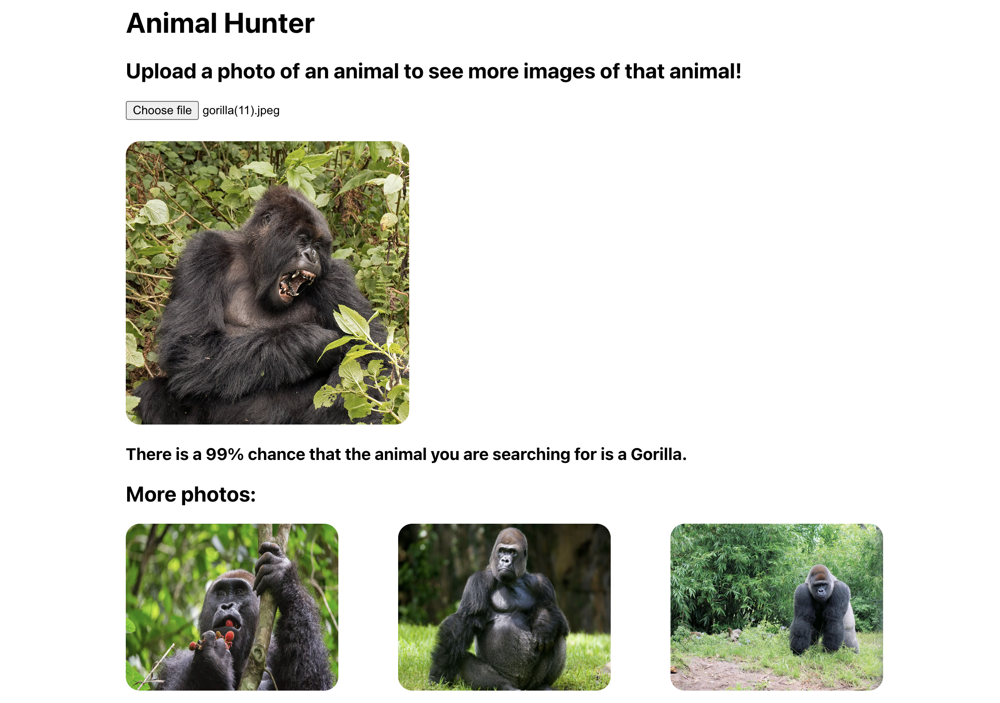

# Animal AI

Use Google Vision to determine the type of animal from a photo that is uploaded by the user.

## Resources

[Build a Custom Image Classification Model Using Google AutoML - Medium](https://medium.com/analytics-vidhya/build-a-custom-image-classification-model-using-google-automl-221e45690aef)

[Convert uploaded image to base64 - Stackoverflow](https://stackoverflow.com/a/20285053)

[Build a Machine Learning Model On Cloud Using Google AutoML - Medium](https://medium.com/analytics-vidhya/build-a-machine-learning-model-on-cloud-using-google-automl-7bd3836f0a3d)

[Convert Curl to Node Axios - Curl Converter](https://curlconverter.com/node-axios)

[AutoML Start - Google](https://cloud.google.com/vision/automl/object-detection/docs/before-you-begin?_ga=2.229171551.-2107613309.1659996131&_gac=1.92075112.1660608515.Cj0KCQjw3eeXBhD7ARIsAHjssr8ytTHRi4HyS7GVK20KUdDAeyPdxRItGRq2etQjvzYgub6lH2BPRF4aAqQwEALw_wcB)

[Managing Service Accounts - Google](https://cloud.google.com/iam/docs/creating-managing-service-accounts#iam-service-accounts-list-gcloud)

[Manage Service Account keys - Google](https://cloud.google.com/iam/docs/creating-managing-service-account-keys#iam-service-account-keys-create-console)

[Install Google Cloud CLI - Google](https://cloud.google.com/sdk/docs/install#interactive)

[Making Predictions - Google](https://cloud.google.com/vision/automl/object-detection/docs/predict#automl_vision_object_detection_predict-nodejs)

---
